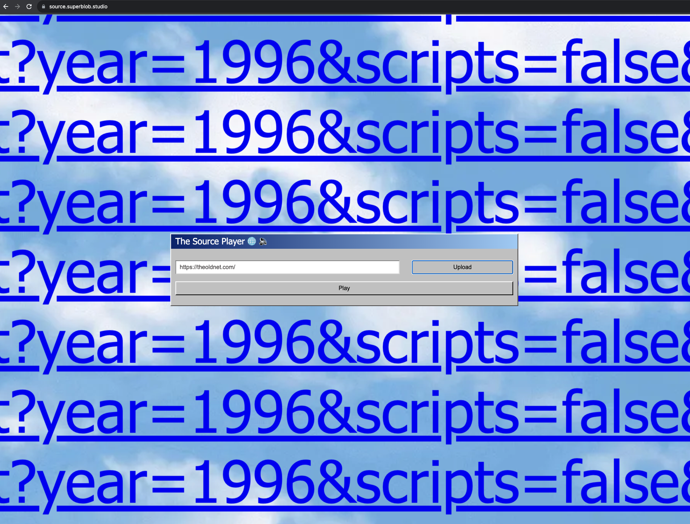
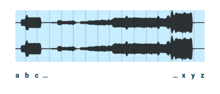

# The Musical Web @ SFPC
## Week 1 - The Source Player

### [source.superblob.studio](https://source.superblob.studio/)

### Hello currentTime

Since the first week’s assignment involved the usage of the HTML audio tag, this project focuses on the **“currentTime”** property of the respective element. I felt drawn to this because it offers a way to “play” or trigger multiple sounds in a generative way from a single source audio file.
Thinking of how to sequence the audio playback, I revisited the bare-bone components of a website - is there something there that I can use to trigger the sounds in a seemingly random, but deterministic way? 

### Looking at links

Since the web evolved as an [information management system](https://webfoundation.org/about/vision/history-of-the-web/), one of its core components are the links used to identify resources. These are the foundation of the inter connectivity between websites as well as for accessing and displaying media on the web.

We discussed in the first class that the audio tag has a **“src”** property that points to the address of the audio file. Similarly, image (img) tags have a “src” property that point to the address of the image, while link (a) tags have a **“href”** property that point to the address of the link. 

I used these going forward to generate a sequence of sounds. The content of the links (both from “src” and “href” properties) are parsed and used to jump to different places in the audio files. Letters at the start of the alphabet jump to the start of the audio, while letters at the end of the alphabet jump to the end of the audio, with everything in-between being interpolated in this way. Non-letter characters such as “/“ or “:” pause the audio. There’s also an additional 35% chance that the audio will be paused irrespective of the character, to introduce some space in the mix.

That was the birth of **The Source Player** - I would generate 10 audio tags based on links found in a website, and trigger the audio files based on the contents of each link, at an interval of around 3 seconds.

### A moment of nostalgia

The only thing needed to do now was to actually get all the “src” and “href” links from a website. This is where things started to get unexpectedly complicated, because most of the web today is rather opaque. 

I first encountered **Cross-origin resource sharing (CORS)** issues, which restrict resources on a web page when they are accessed from another domain outside the domain of the website where they are hosted.

To add to this, a lot of the web today is built as **single page applications (SPAs)**, which barely have any static structure (or links) at all - everything being generated dynamically.

This is why I chose the old-school, ‘90s’ look for the project - I wanted to reminisce about an era when the structure of a website was clearly accessible via the **“View Page Source”** option and when the web, although smaller, felt *freer* than today.

The audio files are the also from that era: dial-up modems, boot sequence with hard drives spinning and the windows 95 startup sound created by Brian Eno.

### Further Exploration Areas

I used a fixed number of audio tags (10) - but the code supports more. Just [fork/copy it](https://github.com/andreiantonescu/sfpc-fall23/tree/main/week1) and modify the number at the start of the script. Same goes with the interval at which the audio files are triggered.

It would be interesting to also completely remove the URL loading part and just play on a given string/text that the user enters. Try splitting up a song into different components (vocal, bass, etc.) and have these as the base audio files.

Ultimately, this is heavily dependent on the english alphabet. I invite people to adapt this to other alphabets and change the rules by which the audio is played.

### Some technical notes

I modified **Math.random** to use a seed. Math.random is not inherently deterministic and cannot be seeded, which did not suit my needs. I wanted to get the same sequence of sounds to play given the same link.

### Credits
https://freesound.org/people/wtermini/sounds/546450/  
https://freesound.org/people/squashy555/sounds/273736/  
https://freesound.org/people/0ktober/sounds/188828/  
https://freesound.org/people/goldenzoomi1/sounds/644997/  
https://wallpapers.com/wallpapers/windows-95-clouds-kfioe6hnh3x8zn4z.html
